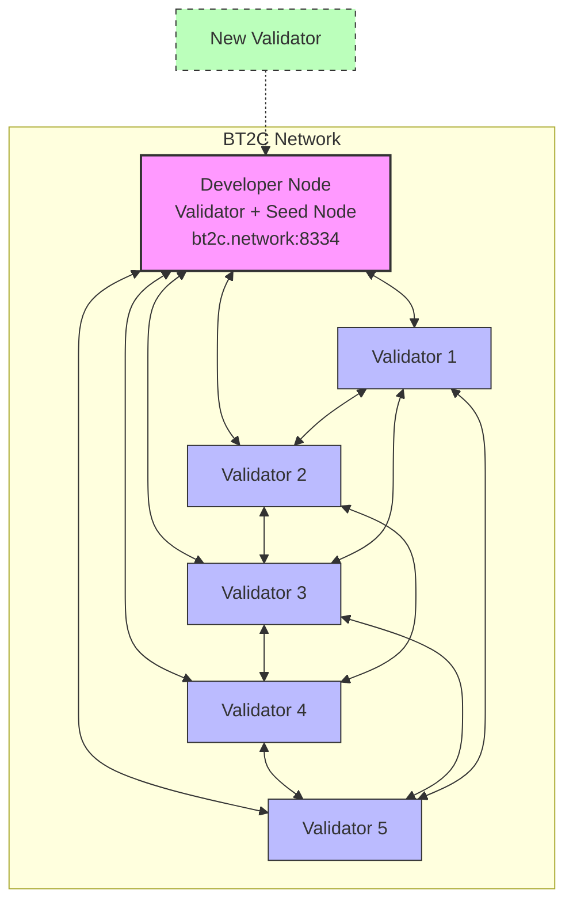
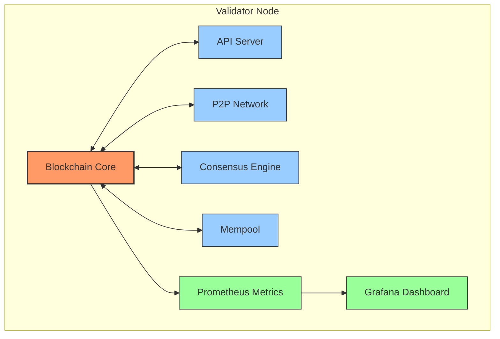
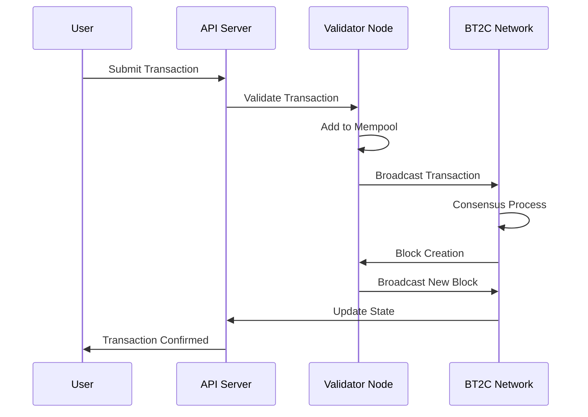
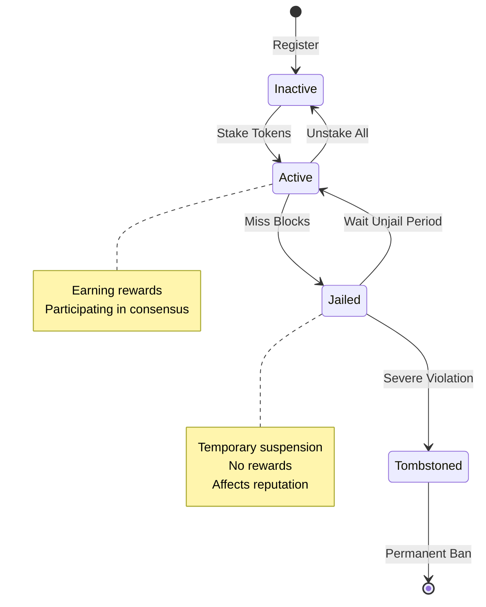
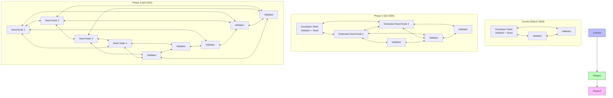
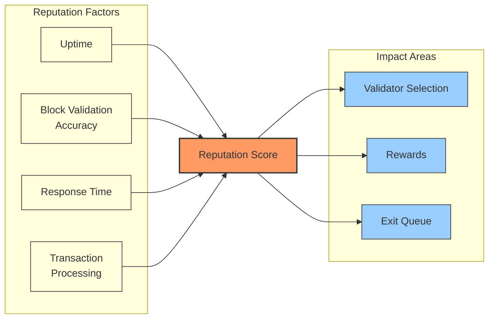

# BT2C Network Architecture Diagram

This document provides visual representations of the BT2C network architecture to help understand how validators, seed nodes, and other components interact.

## Current Network Topology

The current BT2C network uses a simplified architecture where the developer node serves as both a validator and seed node.

## Network Components

### Validator Node Configuration

## Data Flow

The following diagram illustrates how data flows through the BT2C network:

## Validator States

BT2C validators can transition between different states:

## Network Growth Plan

As the BT2C network grows, the architecture will evolve:

## Reputation System Impact

The reputation system affects validator selection and rewards:

## Notes on Diagram Usage

These diagrams are intended to provide a visual understanding of the BT2C network architecture. They can be viewed in any Markdown viewer that supports Mermaid diagrams, or by using the Mermaid Live Editor at [https://mermaid.live](https://mermaid.live).

For the most up-to-date information about the BT2C network architecture, refer to the [NETWORK_ARCHITECTURE.md](NETWORK_ARCHITECTURE.md) document.
